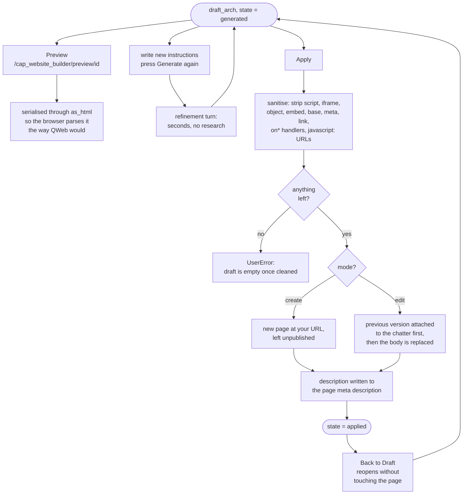

# AI Website Page Builder (`cap_website_builder`)

Odoo 19 module. Describe a page, and an LLM researches it, writes the copy and
turns it into Odoo website snippets a designer can then edit block by block.

Two screens, one app menu:

| Screen | What it does |
|---|---|
| **Page Requests** | The page build pipeline. One record per page. |
| *(scheduled)* | Translation of published pages via Odoo's own translation service — a cron, no screen. |
| **SEO Insights** | Chat answered from live Google Search Console / GA4 data. |

Surfer SEO is not a screen. It is read by the page builder, on requests with
**Use Surfer SEO** ticked, to get a content brief before the copy is written and
to score the copy against it afterwards.

---

## 1. Configuration

Everything third-party lives in **AI Page Builder → Configuration → Settings**
(the same page as **Settings → AI Page Builder**, opened straight at this
module's block), stored as `ir.config_parameter` values. There are no
credential models.

| Setting | Parameter |
|---|---|
| Service account key | `cap_website_builder.google_service_account_json` |
| Search Console site | `cap_website_builder.gsc_site_url` |
| Analytics property | `cap_website_builder.ga4_property_id` |
| Surfer API key | `cap_website_builder.surfer_api_key` |
| Surfer workspace | `cap_website_builder.surfer_workspace_id` |

Every field is `groups='base.group_system'`, so the keys cannot be read over RPC
by a non-administrator. The module reads them back through `sudo()` helpers
(`google_client.get_client(env)`, `research_client.get_surfer(env)`, …) so a
user who may ask a question never needs to see the key that answers it.

Pasting the Google JSON reveals the **service account email**. Grant that
address read access on the Search Console property and the GA4 property, or
Google refuses every request.

**AI models** are still records — `AI Page Builder → Configuration → AI Models`
— because there are several of them and a page request picks one. A model
carries its provider (Mistral / Anthropic / any OpenAI-compatible endpoint), its
API key, its token and timeout budget, and its system prompt.

Four are created on install; each needs its API key filled in before it works:

| Model | Provider | Model ID | Notes |
|---|---|---|---|
| **Claude Opus 5** *(default)* | Anthropic | `claude-opus-5` | the only provider that can search the web in step 2 |
| Claude Sonnet 5 | Anthropic | `claude-sonnet-5` | faster and cheaper, same capabilities |
| **ChatGPT (GPT-5.1)** | OpenAI-compatible | `gpt-5.1` | a **reasoning** model — see below |
| **ChatGPT (GPT-4.1)** | OpenAI-compatible | `gpt-4.1` | OpenAI's largest context window, ~1M tokens; base URL `https://api.openai.com/v1`, reference page limit 400 000 chars (~100k tokens), max tokens 32 000 |
| Mistral Large | Mistral | `mistral-large-latest` | |

The context window matters most in **edit mode**: how much page markup fits in
one call decides how few batches a long page takes. It does not remove the batch
limit, which is deliberate — `REWRITE_BATCH_CHARS` keeps one call from carrying a
whole 90 KB page even when the model could hold it.

**Reasoning models are handled differently on the OpenAI route.** Anything whose
id starts with `gpt-5`, `o1`, `o3` or `o4` gets `max_completion_tokens` instead
of `max_tokens` — those models reject `max_tokens` outright — plus a
`reasoning_effort` derived from **Thinking Budget**: `0` → `low`, up to 8 000 →
`medium`, above that → `high`. Same arrangement as Anthropic's: reasoning and
the answer come out of one budget, so the default is set to answer rather than
deliberate. If a reply comes back empty with `finish_reason: length`, the error
says so and names the two fixes, instead of looking like a hung provider.

> On GPT-4.1 and Mistral, **step 2 has no live web search** — no equivalent of
> Anthropic's server-side tool exists on the plain chat-completions route, so the
> sub keywords come from model knowledge and the chatter says so. Everything else
> in the pipeline behaves identically. `Thinking Budget` is Anthropic-only and is
> ignored elsewhere.

> Both prompts are stored per record. Editing the module's defaults does
> **not** update models that already exist: press **Reset Prompts to Default**
> in the record's header to pick up a new version.

**Thinking Budget** defaults to 0, which sends Anthropic `thinking: disabled`,
and that default matters. Extended thinking is drawn from the *same* budget as
the answer: a model handed 81 Surfer term ranges to satisfy at once spent all
16 000 tokens reasoning and returned `stop_reason: max_tokens` with **zero
characters of text**. From the outside that looks like a hung provider — the
request just runs until the timeout — while costing a full budget of tokens.
The same call with thinking off answered in 73 s. Set a budget above 0 only if
you want reasoning, and `max_tokens` is then raised to keep `ANSWER_HEADROOM`
tokens free for the answer itself.

> Adding or changing a **field** needs an Odoo **restart**, not just an upgrade:
> Python is imported once at startup, so `-u` alone updates the schema from the
> classes already in memory.

---

## 2. How it works, in short

One `cap.website.builder` record per page. Fill in the top of the form, press
**Generate**, and this runs end to end inside that one request:

```
  page title + main keyword  (+ description, reference page, instructions)
              |
   1  description ........ written only if you left it empty
   2  sub keywords ....... AI + live web search -> the 3 strongest phrases
   3  Surfer brief ....... the 4 keywords -> Content Editor -> terms, structure,
              |            questions, competitor topics, score to beat
   4  page copy .......... markdown copy written to that brief
   4b scoring loop ....... push back to Surfer, rewrite while below target,
              |            up to 3 rounds, best version kept
   5  the page ........... with a design template: its markup is the page and
              |            the AI only fills the {placeholder} text slots
              |            without one: copy + palette + the site's own CSS
              |            -> Odoo snippet sections
              v
        draft_arch  ->  Preview  ->  refine  ->  Apply
```

Nothing touches the website until you press **Apply**, and applied pages are
created unpublished.

### How long it takes

Measured on a real page (`odoo inventory management`, Claude Opus 5, Surfer on,
target score 70): **3 to 4 minutes**. Four consecutive successful runs took
185 s, 197 s, 233 s and 258 s.

| Step | Typical | Notes |
|---|---|---|
| 1 Description | ~15 s | skipped entirely when you write it yourself |
| 2 Sub keywords | 30–60 s | one AI call plus up to 5 server-side web searches |
| 3 Surfer | **~5 s reused, up to 120 s fresh** | a new main keyword means a new SERP analysis |
| 4 Page copy | ~75 s | measured directly against a full 81-term brief |
| 4b Scoring | 10–20 s per round | push, then poll until the score settles |
| 5 Layout | 60–90 s | the biggest prompt: copy + palette + style guide |

Worst case is longer: a fresh Surfer analysis plus three scoring rounds (each a
rewrite *and* a recalculation) is **7–8 minutes**. Every measured run reached
the target on the first round, scoring 87–93 against a target of 70, so that
tail is rare.

To make it faster: write the description yourself, keep the main keyword (step 3
drops to seconds), set **Target Surfer Score** to 0 to skip 4b, or untick **Use
Surfer SEO** to skip 3 and 4b together — around two minutes in total.

> It runs **synchronously**, so the browser sits on the button and the Odoo
> worker handling it is busy for those minutes. On a single-worker instance that
> blocks other requests. Moving it to a queued job that posts the draft to the
> chatter is the obvious next step, and is not built.

### What one run produced

The chatter from a real run, which is also how you debug one:

```
Instructions
    Lead with the real-time stock angle, and keep the pricing section short.
Description written for you: Track stock in real time with Odoo inventory ...
Sub keywords for "odoo inventory management": odoo reordering rules,
    odoo warehouse management, odoo barcode scanning
Reusing the Surfer analysis already run for these keywords (editor 16530660).
    No new credit is spent.
Surfer analysed the pages that rank for these keywords: 81 scored terms,
    9 questions, 8 competitors. The AI now writes the page copy to that brief.
Surfer scored the copy 87 out of 100, at or above the 70 asked for, after 1 round.
Content ideas from the search: how to track stock in real time, what is a
    reordering rule, does Odoo support barcode scanning, ...
Palette taken from 8 real sections of this site: /odoo-erp/odoo-connector, ...
Building with the styles of Captivea: 333 classes from cap_website_design (220 KB), ...
Draft built (26704 characters). Review it, then press Apply.
```

The page that came out: 11 snippet sections, 7 images from the site's own media,
and 7 of the site's own classes used 34 times — `cap-reveal`, `cap-ico`,
`cap-media`, `cap-cta`, `cap-hero`, `cap-hero-deco`, `cap-eyebrow`. Its opening
section:

```html
<section class="s_kickoff cap-hero o_colored_level o_cc o_cc1 pt96 pb64"
         data-snippet="s_kickoff" data-name="Cover Kickoff Odoo-v18">
  <div class="cap-hero-deco"></div>
  ...
      <span class="cap-eyebrow">Odoo Inventory</span>
      <h1>Odoo Inventory Management: Real-Time Stock, Reordering Rules ...</h1>
  ...
      <div class="cap-media">
        
```

That is the whole point of steps 3 and 5: the copy is written to what actually
ranks, and the markup is the site's own, not stock Odoo.

### The numbers, and where they live

Every limit in this document is a module constant, not a magic number buried in
a method:

| Constant | Value | File | What it bounds |
|---|---|---|---|
| `SUB_KEYWORD_COUNT` | 3 | `cap_website_builder.py` | phrases taken from step 2 |
| `SURFER_PRIORITY_TERMS` | 25 | `cap_website_builder.py` | terms sent with exact ranges |
| `SURFER_HEADING_TERMS` | 12 | `cap_website_builder.py` | terms asked for in an H2/H3 |
| `SURFER_QUESTIONS` | 12 | `cap_website_builder.py` | questions to answer |
| `SURFER_COMPETITOR_HEADINGS` | 15 | `cap_website_builder.py` | competitor topics listed |
| `SURFER_SCORE_ROUNDS` | 3 | `cap_website_builder.py` | write/score attempts |
| `REWRITE_BATCH_CHARS` | 8 000 | `cap_website_builder.py` | page *text* per edit-mode call |
| `META_DESCRIPTION_CHARS` | 160 | `cap_website_builder.py` | description length |
| `SURFER_WAIT_SECONDS` | 120 | `research_client.py` | wait for a fresh analysis |
| `SURFER_CHAT_WAIT_SECONDS` | 15 | `research_client.py` | the chat's wait, before the cron takes over |
| `SURFER_SCORE_WAIT_SECONDS` | 45 | `research_client.py` | wait for a recalculation |
| `SURFER_POLL_FAST` / `SLOW` / `FAST_WINDOW` | 3 / 10 / 60 | `research_client.py` | poll cadence |
| `RULES_BUDGET` | 26 000 | `theme_style.py` | chars of class vocabulary |
| `HOUSE_EXAMPLES` / `HOUSE_BUDGET` | 8 / 30 000 | `theme_style.py` | mined example blocks |
| `HOUSE_BLOCK_MAX` | 9 000 | `theme_style.py` | biggest single block sent |
| `HOUSE_PAGES_SCANNED` | 25 | `theme_style.py` | pages mined for examples |
| `DEFAULT_TIMEOUT` | 600 | `ai_provider.py` | seconds per AI call |
| `WEB_SEARCH_MAX_USES` | 5 | `ai_provider.py` | searches per request, billed |
| `RETRY_ATTEMPTS` / `RETRY_BACKOFF` | 4 / 5 s doubling | `ai_provider.py` | retries on 429/5xx/529 |
| `ANSWER_HEADROOM` | 8 000 | `ai_provider.py` | tokens kept free when thinking is on |

`ai_provider._post()` retries `429, 500, 502, 503, 504, 529` four times, backing
off 5 s → 10 s → 20 s and honouring `Retry-After`. One `529 overloaded` from the
provider used to throw away a whole pipeline — several minutes of work and a
Surfer credit — for a busy moment that clears in seconds.


---

## 3. The page build process, in detail

One `cap.website.builder` record per page. The user fills in the top of the
form, presses **Generate**, and the pipeline runs end to end in that one
request.

### Input

| Field | Required | Notes |
|---|---|---|
| Page title | yes, in create mode | The page's name and `<h1>` subject. |
| Main keyword | yes | The phrase the page must rank for. |
| Page description | no | Left empty, the AI writes it (step 1). |
| Content reference page | required in edit mode | Reference for **what the page says**. Create: its text is source material for the writer. Edit: the page being rewritten, and its current text is the base the new copy starts from. |
| Design template | no | One of the theme's page templates. Set it and the template **is** the page: its markup is copied verbatim and the AI only writes the text that goes in its `{placeholder}` slots — it never sees markup, so it cannot drop, reorder or invent a section. Its own words are ignored. In edit mode, setting it rebuilds the page to it; leaving it empty keeps the existing design. It may also carry its own content and build instructions, which are added to the AI model's matching prompts. |
| May add theme sections | no | Only shown with a design template. Off (the default), the page gets exactly the template's sections. On, and only if your **Instructions** ask for something the template does not cover, the AI may also add whole blocks from the theme's `s_cap_*` catalogue — it answers with a block name and a position, and the module inserts the theme's own markup. |
| Instructions | no | Anything extra the AI should know — about the words *or* the design; they reach both the copy step and the layout step. Leaving this empty **and** picking no design template is what makes the layout a random draw. **Posted to the chatter before the run starts**, because the field is cleared once a draft exists — otherwise what you asked for is gone the moment the page is built, and a page that came out wrong cannot be told from one that was asked for something else. Every refinement turn posts its own instructions the same way. |
| Use Surfer SEO | — | Ticked by default when a Surfer key is configured. Decides whether step 3 runs. |
| Target Surfer Score | — | The score the copy must reach, default 70. 0 writes the copy once and never scores it. |


### The full branch map

Every path a Generate can take. Diamonds are decisions, dotted boxes are chatter
messages, and every dead end is a message rather than a silent stop.

```mermaid
flowchart TD
    START([Generate pressed]) --> G0{"mode = edit and<br/>no reference page?"}
    G0 -->|yes| E0["UserError:<br/>pick the page to edit"]
    G0 -->|no| HIST{"conversation<br/>history exists?"}

    HIST -->|yes| RF1{"instructions<br/>written?"}
    RF1 -->|no| E1["UserError:<br/>write the change first"]
    RF1 -->|yes| RF2["_refine: one AI call<br/>history + new instructions<br/>no research, no Surfer, no credit"]
    RF2 --> RF3{"HTML<br/>returned?"}
    RF3 -->|no| E2["chatter: the AI<br/>returned no HTML"]
    RF3 -->|yes| DRAFT

    HIST -->|no| P1{"main keyword<br/>set?"}
    P1 -->|no| E3["UserError:<br/>enter the main keyword"]
    P1 -->|yes| P2{"create mode and<br/>no page title?"}
    P2 -->|yes| E4["UserError:<br/>enter the page title"]
    P2 -->|no| P3{"Use Surfer ticked<br/>but no API key?"}
    P3 -->|yes| E5["UserError before any AI call:<br/>add the key or untick the box"]
    P3 -->|no| S1

    S1{"description<br/>empty?"} -->|no| S1B["use yours as written"]
    S1 -->|yes| S1A["AI writes it, max 160 chars<br/>chatter: description written for you"]
    S1A --> S2
    S1B --> S2

    S2["step 2: ask for 3 sub keywords"] --> S2Q{"provider supports<br/>web search?"}
    S2Q -->|"Anthropic"| S2A["live search, max 5, billed"]
    S2Q -->|"Mistral / OpenAI-compatible"| S2B["from model knowledge<br/>chatter says so"]
    S2A --> S2R{"any keywords<br/>returned?"}
    S2B --> S2R
    S2R -->|no| S2N["chatter: none found,<br/>main keyword alone"]
    S2R -->|yes| S2Y["main + up to 3 subs"]
    S2N --> S3
    S2Y --> S3

    S3{"Use Surfer SEO<br/>ticked?"} -->|no| S3N["chatter: Surfer off,<br/>the AI plans coverage"]
    S3 -->|yes| S3C{"this request already has<br/>an editor for this keyword?"}
    S3C -->|yes| S3R["reuse it<br/>chatter: no new credit"]
    S3C -->|no| S3L{"Surfer already holds one<br/>for this keyword, &lt; 7 days old?"}
    S3L -->|yes| S3R
    S3L -->|no| S3W["create Content Editor<br/>1 credit spent"]
    S3W --> S3X{"did the create call<br/>come back?"}
    S3X -->|yes| S3P
    S3X -->|"connection lost"| S3Y{"an editor for this keyword<br/>appeared in the last 20 min?"}
    S3Y -->|yes| S3Z["adopt it<br/>chatter: connection dropped,<br/>job picked up, nothing ordered twice"]
    S3Y -->|no| S3E
    S3Z --> S3P
    S3R --> S3F["fetch the 4 guideline blocks<br/>in parallel"]
    S3P{"analysis done<br/>within 120 s?<br/>(a poll that cannot reach<br/>Surfer keeps waiting)"}
    S3P -->|no| S3T["chatter: still analysing,<br/>editor keeps running"]
    S3P -->|"API error"| S3E["chatter: Surfer could<br/>not be used"]
    S3P -->|yes| S3F
    S3F --> S3OK["brief: terms with ranges,<br/>structure, questions,<br/>competitor topics, score to beat"]

    S3N --> S4
    S3T --> S4
    S3E --> S4
    S3OK --> S4

    S4{"brief<br/>available?"} -->|yes| S4A["write copy to Surfer's coverage<br/>content_source = surfer"]
    S4 -->|no| S4B["model plans its own coverage first,<br/>then writes<br/>content_source = ai"]
    S4A --> S5
    S4B --> S5

    S5{"target score &gt; 0<br/>and brief and editor?"} -->|no| S6
    S5 -->|yes| SC1["push copy to Surfer,<br/>poll until the score settles"]
    SC1 --> SC2{"score<br/>&gt;= target?"}
    SC2 -->|yes| SC3["chatter: reached in N rounds"]
    SC2 -->|no| SC4{"round 3<br/>reached?"}
    SC4 -->|no| SC5["local checks name the gaps:<br/>terms low/high, missing headings,<br/>word and heading counts"]
    SC5 --> SC6["AI rewrites"]
    SC6 --> SC1
    SC4 -->|yes| SC7["chatter: not reached,<br/>best of the 3 kept"]
    SC3 --> S6
    SC7 --> S6

    LAY --> IMGS["strip every img and<br/>background-image, prune<br/>the wrappers left empty"]
    IMGS --> LAYQ
    S6{"design<br/>template set?"} -->|yes| FI["step 5t: fill the template<br/>its markup is the page"]
    FI --> FIQ{"template<br/>readable?"}
    FIQ -->|no| FIF["chatter says why,<br/>falls back to a palette"]
    FIF --> PAL
    FIQ -->|yes| FIX{"'May add theme sections'<br/>on and instructions given?"}
    FIX -->|yes| FIA["one call: which s_cap_* blocks<br/>and where, by name only<br/>-> module inserts the theme's markup"]
    FIX -->|no| FIS
    FIA --> FIS["collect the text slots:<br/>the {placeholder} ones,<br/>batched at 8k chars"]
    FIS --> FIL["one call per batch:<br/>JSON of the new wording,<br/>no markup either way"]
    FIL --> FIM{"more<br/>batches?"}
    FIM -->|yes| FIL
    FIM -->|no| FIW["write the strings back<br/>into the same nodes,<br/>+ the form subject attribute"]
    FIW --> FIR["deep_signature check:<br/>every element, tag and class"]
    FIR --> DRAFT
    S6 -->|"no: mode = edit<br/>with a content reference"| RW["step 5b: rewrite in place<br/>the existing body + the new copy"]
    RW --> RWQ{"body<br/>readable?"}
    RWQ -->|no| RWF["chatter says why,<br/>falls back to building a page"]
    RWQ -->|yes| RWB["collect every text node,<br/>numbered, batched at 8k chars"]
    RWB --> RWL["one call per batch:<br/>JSON of new wording only,<br/>no markup either way"]
    RWL --> RWM{"more<br/>batches?"}
    RWM -->|yes| RWL
    RWM -->|no| RWA["write the strings back<br/>into the same nodes"]
    RWA --> RWV{"each replacement:<br/>text, non-empty, in range?"}
    RWV -->|no| RWX["skip it, original text stays"]
    RWV -->|yes| RWK["slot updated"]
    RWX --> RWR
    RWK --> RWR["deep_signature check:<br/>every element, tag and class"]
    RWR --> DRAFT
    RWF --> PAL
    S6 -->|"no: create, and<br/>no template"| PAL{"palette<br/>source"}
    PAL -->|"the Captivea theme<br/>is installed"| PA["its 50+ s_cap_* snippets:<br/>every name, then full markup<br/>up to the context budget"]
    PAL -->|"no theme, but site pages<br/>use their own classes"| PB["8 sections mined<br/>by set cover"]
    PAL -->|"neither"| PC["4 text-only Odoo snippets"]
    PA --> STY
    PB --> STY
    PC --> STY

    STY{"site has its<br/>own CSS?"} -->|yes| STA["style guide: class vocabulary<br/>+ JS hooks"]
    STY -->|no| STB["chatter: no custom CSS,<br/>theme snippets only"]
    STA --> LAY["one AI call, returns<br/>snippet markup"]
    STB --> LAY
    LAYQ{"HTML<br/>returned?"}
    LAYQ -->|no| E6["chatter: no HTML,<br/>state stays draft"]
    LAYQ -->|yes| DRAFT(["draft_arch saved<br/>state = generated"])
```



Any AI call in that map can hit a busy provider. `429`, `500`, `502`, `503`,
`504` and `529` are retried four times, backing off 5 s → 10 s → 20 s, before
the step gives up — one overloaded moment used to cost the whole pipeline.

### After the draft



### Which path a run takes

Four switches decide what actually happens. Every one of them is announced in
the chatter, so a run can be read back afterwards.

| Switch | Set | Not set |
|---|---|---|
| **Conversation history** | Generate is a **refinement turn**: your instructions are applied to the existing draft, no research is repeated | Generate runs the **full pipeline**, steps 1–5 |
| **Mode** | *Edit* — the page is **rewritten in place**: same markup, new words, and Apply replaces its body | *Create* — a layout is built for the copy and a new unpublished page is made at the URL you gave |
| **Design template** | the template's markup **is** the page: it is copied verbatim and the AI only fills its text slots, so no section can be lost, reordered or invented | the AI lays the page out itself, from the Captivea theme's snippet catalogue, then from sections mined off the site's own pages, then from standard Odoo snippets |
| **May add theme sections** | with a template *and* instructions asking for something it does not cover, the AI may add whole `s_cap_*` blocks — chosen by name, inserted by the module | the template's sections are all the page gets |
| **Content reference page** | its text feeds the description and the copy in both modes — in edit mode it is also the page being rewritten, and its current text is the base | the copy is written from the keywords and the brief alone |
| **Use Surfer SEO** | steps 3 and 4b run: a real brief, and the copy is scored and rewritten until it reaches the target | both are skipped; the AI plans its own coverage and the copy is written once |

Which means, concretely:

- **Surfer on + design template** — the strongest combination. Copy written to
  what ranks, poured into a design that is already signed off. The AI writes no
  markup at all on this route.
- **Surfer on, no template** — copy written to what ranks, markup built by the
  AI from the theme's snippet catalogue.
- **Surfer off + design template** — the AI works out the coverage itself, but
  the page is still exactly the template.
- **Surfer off, no template, no theme, no site pages** — everything falls back:
  the AI plans coverage, and the six standard Odoo snippets are the palette.
  This is the plainest output the module can produce.

### Generate → the pipeline steps

`action_generate` branches: with no conversation history it runs the pipeline,
otherwise it runs a refinement turn (see below).

**1. Description** — `_step_description`

- **You filled it in** — nothing happens. No AI call, no message; your text is
  used as written, both as the brief for the copy and later as the page's meta
  description.
- **You left it empty** — one AI call writes it from the page title and the main
  keyword, capped at 160 characters (`META_DESCRIPTION_CHARS`) because search
  engines cut the snippet around there. `_clean_description()` strips the
  wrappers models like to add ("Meta description:", surrounding quotes, trailing
  ellipsis) and cuts on a word boundary. The result is posted to the chatter and
  saved on the record, so it is yours to edit before Apply.

Either way the description does three jobs: brief for the copy, part of the
question asked in step 2, and `custom_instructions` on the Surfer editor.

**2. Sub keywords** — `_step_sub_keywords`

This is the only place keywords are *generated*; the main keyword is always
yours. The model is given the main keyword, the page title and the description,
and asked for the `SUB_KEYWORD_COUNT` (3) strongest phrases around it — phrases
people really type, more specific than the main keyword, each able to carry its
own section, and not near-duplicates of one another. It answers as JSON
(`{"keywords": [...], "ideas": [...]}`), pulled out by `_extract_json()`, which
tolerates the markdown fences and stray prose models wrap answers in.

`ideas` is the second half of the same answer: up to `CONTENT_IDEA_COUNT` (8)
**content ideas from the search** — what people actually ask around the keyword,
in their words. They ride along on a web search that is already being paid for,
which is the point: this is the one call in the pipeline that has genuinely
looked, so headings taken from it beat headings a model invented. Stored on
`content_ideas` and shown on the **Keywords** tab.

- **Anthropic** — `web_search=True` sends the server-side `web_search_20250305`
  tool, capped at `WEB_SEARCH_MAX_USES` (5) searches. Anthropic runs the
  searches and feeds itself the results, so there is no tool loop here; only the
  model's own text blocks are read back. **These searches are billed.**
- **Mistral / OpenAI-compatible** — no equivalent server tool exists, so the
  flag is ignored and the model answers from what it knows. The chatter says so
  in as many words rather than letting a stale answer pass for research.

Results are deduplicated against the main keyword and each other, capped at 3,
and stored on `sub_keywords`, one per line. **If none come back**, the chatter
says so and the page is written on the main keyword alone — the run continues.

The four keywords (main + up to 3 subs) are what step 3 sends to Surfer and what
step 4 writes to. They are regenerated on every full run, so they drift a little
between runs; that is why the Surfer editor is cached on the *main* keyword
only.

**3. Surfer brief** — `_step_surfer_terms`

Returns `(brief as text, brief as data)`. There are five ways out, and each one
posts a different chatter line, because "no Surfer brief" for four different
reasons should not look like one thing:

| Situation | What happens |
|---|---|
| **Use Surfer SEO unticked** | skipped; chatter says the AI will work out the coverage from the keywords itself. Step 4b is skipped too |
| **Ticked, no API key** | refused **before step 1**, so nothing is spent. The error names both fixes: add the key, or untick the box |
| **Ticked, editor already run for this main keyword** | reused; chatter says so and no credit is spent |
| **Ticked, connection lost while ordering** | the job Surfer had already started is found and adopted; chatter says so and no second credit is spent |
| **Ticked, analysis not finished in 120 s** | falls through to step 4's AI-only route; the editor keeps running on Surfer's side and the next Generate picks it up |
| **Ticked, API error** | falls through the same way, with the error in the chatter |

The checkbox defaults to ticked when a Surfer key is configured and unticked
when there is none, so the default is the useful one without ever promising a
service that is not set up — but the decision is the user's per page, not a side
effect of what happens to be in the settings.

The Content Editor is **reused while the main keyword is unchanged**
(`surfer_keyword`), so a retry after a failure costs no credit. The key is the
main keyword alone: the sub keywords come from a fresh web search each run and
drift between them, so keying on all four would mean a new editor every retry.

#### Never paying twice for the same analysis

A Content Editor costs a credit and takes minutes, and the id is the only thing
that connects a request to the job it paid for. Anything that loses the id —
a dropped connection, a rolled-back transaction, a killed worker — used to mean
the credit was spent and thrown away, and the next Generate spent another. It is
visible in the account's own history: `erp odoo` was analysed four times and
`gold odoo partner switzerland` twice, 28 minutes apart, each pair the same
analysis paid for more than once.

Four things now stand between an interruption and a second credit, in order:

1. **The request remembers its editor.** `surfer_editor_id` and
   `surfer_keyword` are written **and committed** the moment Surfer answers
   (`_remember_surfer_editor`), before the copy, the scoring rounds or the
   layout can fail. A commit rather than a plain write, because a plain write
   rolls back with everything else and takes the id with it.
2. **Surfer is asked what it already has.** Before ordering, the workspace is
   listed (`GET /api/v2/workspaces/{id}/content_editors` — a free read, no
   credit) and an editor for the same main keyword, less than
   `SURFER_REUSE_HOURS` (7 days) old, is adopted. Where several match, one whose
   secondary keywords are the same set wins; otherwise the newest does. Past a
   week the SERP has moved and the old brief describes a page that no longer
   ranks, so it is left alone.
3. **A create call that loses its answer is recovered, not repeated.** A
   timeout, a reset connection or a 502 says nothing about whether the job was
   created — unlike a 401 or a 422, which say it was not. That difference is why
   `SurferUnreachable` exists as its own exception. On one, the workspace is
   listed again after 5 s and an editor for this keyword that appeared in the
   last `SURFER_ADOPT_MINUTES` (20) is adopted. If there is none, the error is
   raised: creating a second one is the mistake this is here to prevent.
4. **Reads are retried, writes never are.** `GET` is repeated up to 3 times
   through a connection error or a 429/5xx, because repeating it is free. `POST`
   and `PUT` are never repeated — a retried create is a second editor and a
   second credit. And a poll that cannot reach Surfer keeps waiting to its
   deadline instead of abandoning the run: the analysis is running on Surfer's
   side whether or not this side can see it.

`ensure_content_editor` returns which of the three happened — `created`,
`reused` or `recovered` — and the chatter says so in plain words, because
"reused an analysis from Tuesday" and "your connection dropped and the job was
picked back up" are different things for a user to know.

Ticking it without a key is refused **before the first AI call**, not at step 3:
finding out late would mean two calls already paid for and a page written the
way the user did not ask for.

The 4 keywords (main + 3 subs) start a Surfer Content Editor. The module waits
up to **120 s**, polling every 3 s for the first minute and every 10 s after —
most analyses land early, and a fixed slow interval would sit on a finished job.

Once the editor is `completed`, all four guideline blocks (`terms`, `structure`,
`topics_and_questions`, `competitors`) are fetched **in parallel**, so the brief
costs one round trip instead of four. What reaches the writer is the whole
brief, not a word list:

- **Structure** — Surfer states each target as a ratio of a baseline factor, so
  the ratios are multiplied back out into real word, heading, paragraph and
  image counts. `character_count` is dropped: it only restates the word count.
- **Terms with their ranges** — the top 25 with exact min/max, the rest as
  secondary. A term without its range is a word to sprinkle; with it, it is a
  target that can be met or missed.
- **Heading terms**, the questions readers actually ask, the topics competitors
  cover, and the score to beat.

It lands rendered on `surfer_terms`. **The AI then writes the copy from what
Surfer sends back** — Surfer supplies the coverage, step 4 supplies the words.

> The payload shapes are taken from a working script rather than guessed:
> guideline rows arrive under `data`, terms carry `included` / `item` /
> `target_range` / `heading`, and a competitor only counts toward the score when
> `included`.

Surfer never blocks the build. The checkbox off, an API error, or an analysis
still running after 120 s all fall through to step 4's AI-only route with a
chatter note saying which happened — a Surfer job regularly takes minutes, and
the user is holding a button down.

**4. Page copy** — `_step_copy`
The AI writes the copy as plain text with markdown headings — one H1, `##`
sections, `###` sub sections, paragraphs and lists. No HTML here: layout is step
5's job, and mixing the two produces worse copy and worse markup.

The brief it is given always contains the page title, the description, the main
keyword, the sub keywords, and your **Instructions** if you wrote any.

All 4 keywords are then listed again, under a heading that names **where each one
has to appear** — main keyword in the H1, the opening paragraph and the body,
written so the H1 can be reused as the title tag; each sub keyword in the `## `
heading of its own section and in the words under it. Written out in full each
time, not implied or paraphrased or split across two clauses, once per placement,
and never two keywords crammed into one H1. That block is the same whichever
route runs below, so the requirement does not depend on whether Surfer answered,
and it is the same list step 4c scores the copy against.

The **content ideas from Google searches** follow, when step 2 found any: use
them as the H2 headings wherever one fits, phrased close to how it was searched,
skipping any this page has no business answering. Offered as material rather than
a running order — a page that answers six of them well beats one that lists all
eight.

What changes is the coverage:

- **With a Surfer brief** — step 3's terms are handed over as the coverage the
  page has to hit, to be worked into normal sentences rather than stuffed in.
- **Without one** — Use Surfer SEO unticked, an API error, or an analysis that
  did not finish. The model is told to do Surfer's job first: decide what a searcher
  expects for each of the 4 keywords, give every keyword its own section, work
  out the terms and questions that section must contain, and only then write.
  The plan stays internal; the answer is the finished copy.

Stored on `article_body`; `content_source` records which route was taken
(`Surfer brief + AI` or `AI only`).

**4b. Scoring loop** — `_step_score`
Runs when Surfer supplied the brief and **Target Surfer Score** is above 0
(default 70). The article is pushed back into the *same* Content Editor the
brief came from — same SERP analysis, so the score is comparable — and Surfer
recalculates.

The recalculation is polled, not slept through: the score counts only once
`updated_at` has moved *and* the same value has been read twice, which is what
tells a finished recalculation apart from a stale reading of the previous one.

Below target, the AI rewrites and the new version is scored again, up to
**3 rounds** (`SURFER_SCORE_ROUNDS`). A rewrite is never told merely "score 61,
do better" — `_score_feedback()` runs the free local checks and names the gaps:
which terms are under their minimum and by how much, which are over their
maximum, which are missing from headings, and how far the word, heading,
paragraph and image counts are from target. When everything countable is
already on target it says so, and asks for depth instead.

**The best-scoring version is kept, not the last** — a rewrite aimed at one gap
can open another, and shipping a worse page than one already written would be
perverse. `surfer_score` and `surfer_score_rounds` record the outcome.

Every exit is announced in the chatter: target reached and in how many rounds;
target missed after 3 rounds, with the best score and what to do about it
(lower the target, or add instructions); Surfer erroring or not scoring in time,
in which case the copy stands as written. Then step 4c.

**4c. Keyword placement check** — `_step_keyword_check`
The last gate before the copy becomes a page. Not "is the keyword on the page"
but **which of the five SEO placements does it reach** — the slots an SEO tool
scores:

| Slot | Is | Comes from |
|---|---|---|
| **T** | title tag | the request's **Page Title** |
| **D** | meta description | the request's **Page Description** |
| **H1** | the `# ` line | the copy |
| **H2** | every `## ` / `### ` heading | the copy |
| **C** | the paragraphs and lists | the copy |

Each keyword is aimed at the slots it can actually carry, and only those count
against it:

| Keyword | Aimed at | Why not the rest |
|---|---|---|
| main | T, D, H1, C | H2 is a bonus once it already holds the H1 |
| each sub | H2, C | a title tag with four keywords crammed in ranks for none |

`keyword_placement()` returns a row per keyword — where it was found, where it
was aimed, what is missing. A slot a keyword was never aimed at is not a gap, so
the target is closing what is missing, not filling every cell.

**Nothing is posted when it passes.** The chatter only hears about this step when
a gap survives it — the same failure-only rule the rest of the module follows. A
run that placed everything is silent here.

The check is local and free, so it runs on every request. **Only a copy with a
gap costs an AI call** — the normal outcome adds no latency and no message.

It runs *after* the scoring loop, not before: a Surfer rescore rewrites the copy
and can drop a keyword the first draft had, so checking earlier would be
checking a version that never reaches the page.

##### Matching is Odoo's own rule, not ours

`contains_keyword()` is `isKeywordIn` from
`website/static/src/components/dialog/seo.js`, in Python: the keyword matched
**literally**, case-insensitively, with a word separator or the end of the string
on either side. Odoo's separator class is reproduced verbatim — it exists there
because JavaScript's `\b` is not unicode aware, and copying it is what makes
accented keywords behave the same in both tools.

This is deliberate parity, not convergent design. Odoo's **Optimize SEO** dialog
is where anyone will check the page afterwards, and a keyword this module calls
placed while that dialog marks it missing is just two tools contradicting each
other in front of the user.

Verified against the real JavaScript, 13/13 identical:

| Text | Keyword | Match |
|---|---|---|
| "Odoo Implementation Partner for…" | `odoo implementation partner` | found |
| "we are odoo implementation partner**s**" | `odoo implementation partner` | **missing** — `s` is not a separator |
| "Odoo ERP**,** consulting" | `odoo erp consulting` | **missing** — the comma is not in the keyword |
| "odoo**-**migration**-**cost" | `odoo migration cost` | **missing** — hyphens are not spaces |
| "odoo implementation\npartner" | `odoo implementation partner` | **missing** — a space is not a newline |
| "odoo␣␣implementation␣␣partner" | `odoo implementation partner` | **missing** — double spaces |
| "partner for odoo implementation" | `odoo implementation partner` | **missing** — words present, phrase absent |
| "expertise Odoo (ERP) complète" | `erp` | found |
| "ERPNext is different" | `erp` | **missing** |
| "Notre société à Genève" | `société` | found — accents work |

**Stricter than it looks**, and stricter than this check used to be: plurals and
punctuation inside a phrase now count as absent. That is why the copy brief and
`KEYWORD_FIX_PROMPT` both spell out *exactly as given — same words, single
spaces, singular, one line*. The alternative was a looser rule that quietly
disagreed with the panel the user actually looks at.

##### Slot boundaries, also Odoo's

| Slot | Odoo reads | This module reads |
|---|---|---|
| H1 | `#wrap h1` | the `# ` line |
| H2 | `#wrap h2` | the `## ` lines — **`###` is body text**, since Odoo marks no other level |
| T | the title tag | the request's Page Title |
| D | the meta description | the request's Page Description |
| C | `body.textContent` | the **whole** copy, headings included |

C containing the headings is Odoo's behaviour, not an oversight: a keyword in the
H1 shows a tick under C in both tools, so C is the easy slot and the meaningful
gaps are H1, H2, T and D.

When a slot is empty, `KEYWORD_FIX_PROMPT` gets the copy and the gaps *named per
slot* — `"odoo erp consulting": missing from an H2` — and returns the whole copy
with them closed: same sections, same order, same facts, and into a heading where
no sentence can carry the wording naturally. Up to **2 rounds**
(`KEYWORD_FIX_ROUNDS`).

Three guards on the result:

- A revision is kept **only if it fills more slots than it empties**
  (`_slots_filled()` strictly up). A model that moves a keyword out of a heading
  to put it in a sentence has not helped, and taking that would be worse than
  doing nothing.
- **T and D are reported, never rewritten.** They are not the copy — the title
  tag is what you typed, and rewriting someone's page title to fit a keyword is
  not a trade this step should make on its own. If only T/D remain, the loop
  stops instead of paying for a call that cannot reach them.
- An AI error is reported and stepped over rather than raised, because the copy
  is still good enough to build a page from.

`DESCRIPTION_PROMPT` now requires the main keyword in the description it writes,
so **D** is usually filled before this check ever runs. It only stays empty when
you wrote the description yourself — in which case the chatter says so and leaves
your wording alone.

**5. Layout** — `_step_layout` or `_step_rewrite`

Which one runs is decided by the **design template**, not by the mode:

| Mode | Design template | Route | What happens to the page |
|---|---|---|---|
| create | set | `_step_template_fill` | the template's markup **is** the page; only its text slots are written |
| create | empty | `_step_layout` | laid out by the AI from the theme catalogue, then the site's own sections, then stock snippets — to your instructions, or to a randomly drawn shape when you gave none |
| **edit** | **set** | **`_step_template_fill`** | **rebuilt to that template; the old design is replaced** |
| **edit** | **empty** | **`_step_rewrite`** | **words change, structure untouched** |

A design template wins in both modes: choosing one is the strongest statement
about the design a user can make, so the page becomes that template and the AI
is given no markup to change. Editing without a template is the safe default for
*"fix the wording on this page"*: rebuilding there would silently redesign a page
nobody asked to redesign.

Both template-fill and in-place rewrite share the same guarantee, described
next — only strings travel, in both directions.

##### Who decides the design, and what happens when nobody does

Three cases, checked in `_is_free_hand_design()`:

| Design template | Instructions on the request | What decides the layout |
|---|---|---|
| set | anything | the **template's markup**, outright |
| empty | written | **your instructions**, sent to the layout step as the design brief |
| empty | empty | a **shape drawn at random**, one of 648 |

The middle row is new: your Instructions used to reach the copy step and stop
there, so on a first run the only way to say anything about the design was to
pick a template. They are now also appended to the layout message, told to decide
where they say anything about how the page looks and to be ignored where they
only talk about the words.

**The random draw.** With no template and no instructions, the alternative to a
drawn shape is not "no shape" — it is *the same shape every time*. Same copy,
same palette, same prompt, same page: every free-hand page on a site converges on
one stack of full-width prose blocks in the same order.

So six choices are drawn in Python — opening, section rhythm, where the emphasis
goes, closing, colour rhythm, spacing — from small vocabularies that multiply out
to **648 combinations**:

```
- Open with the H1 alone on a coloured band, and put the first real section
  immediately under it with no lead paragraph between them.
- Work in pairs: a heading-and-intro block, then a columned block that carries
  its detail.
- Give the middle section a coloured background so the page has a centre.
- Close with a short stack of question-style headings and their answers, then
  the call to action.
- Keep o_cc1 throughout and use only the spacing classes to separate sections.
- Default to pt48 pb48, tightening to pt24 pb24 between two sections that
  belong together.
```

Drawn in code rather than by telling the model to "be creative", and that is the
whole point: a model asked to vary its own output varies what is cheap to vary
and keeps its habits. Handed one concrete shape, it builds that shape.

Every recipe line is **text-only** — no hero image, no photo grid — because
`strip_images()` removes images from generated pages anyway, and a drawn shape
built around a picture would be a shape the module then guts.

The draw is unseeded: pressing **Generate** again is how you ask for a different
design, so two runs of the same request are meant to disagree. The chatter prints
the drawn shape, so one that came out well can be asked for again by hand.

It is a shape, not a licence. The palette above it stays exhaustive, the markup
rules still bind, a section still only exists if the copy has something to put in
it, and where the shape names a block the palette lacks, the nearest one is used.

**The in-place rewrite never sees the markup.**

You asked for new words, not a new design, so the markup is neither sent nor
returned. The page's text is
pulled out of the tree, the model supplies replacement wording for the pieces
the new copy actually covers, and those strings are written back into the same
nodes.

That is a guarantee rather than an instruction. A model that never sees a tag
**cannot** drop an image, add a button or a form, or collapse a card grid into a
paragraph. Asking for markup back always can, however firmly the prompt forbids
it — and did: on a real 12-section page every top-level block came back correct
while, inside them, `img` went 22 → 11, `h3` 29 → 18 and `div` 176 → 132. A
check that only compares top-level blocks waves that through.

How it works:

1. The body is parsed and `page_writer.text_slots()` collects every text-bearing
   node in document order — both a node's own text and its tail, since
   `<strong>Odoo</strong> handles this` is half tail.
2. Those strings are numbered and sent in batches of `REWRITE_BATCH_CHARS`
   (8 000 chars **of text**, so an 84 KB page is a few thousand characters and
   443 slots), together with the new copy.
3. The model answers with JSON — `{"3": "new wording", "7": "…"}` — and is told
   plainly that **leaving a number out is the right answer** whenever the new
   copy says nothing about it. Navigation, button labels, form labels, captions
   and legal lines are meant to survive untouched.
4. `apply_text_slots()` writes them back, keeping each slot's surrounding
   whitespace. Anything missing, empty, out of range, or containing `<` is
   skipped and the original text stays: the worst outcome of a bad answer is a
   page that did not change.
5. `deep_signature()` then verifies the whole body at **full depth** — every
   element, its tag and its classes — and the chatter reports *"markup verified
   identical: all N elements, their nesting and their classes are unchanged"*,
   or names exactly which tag counts moved.

Measured on the real page: 443 slots, **702 elements before and after**, images
22 → 22, links 15 → 15, and an answer trying to inject
`<a class="btn btn-primary">Book a demo</a>` refused.

The body is read with `combined=False`, because this markup is written straight
back and folding the inherited views in would bake them into the base view and
apply them twice.

Only a page with **no readable body** falls back to building a page from the
copy.

**With a design template, the page is not laid out at all — it is filled.**
`_step_template_fill` copies the template's markup as the skeleton, collects the
`{placeholder}` text slots the theme wrote into it, and asks the AI for the
wording of each one. See *"The design template route"* below.

**Without a template, create mode builds a page.** The copy goes back to the AI
with two attachments — a **snippet palette** and
the **site's own style guide** — and comes back as the markup of an Odoo page:
real `s_*` snippet sections with their `data-snippet` / `data-name` attributes,
colour classes and grid structure, so the website editor can edit each block.
Result lands in `draft_arch` and the state becomes **Generated**.

The palette is chosen in this order, and the chatter says which was used:

| Condition | Palette |
|---|---|
| **Design template set** | never reaches this route — the template is filled instead |
| **The Captivea theme is installed** | its own `s_cap_*` snippets from `theme_snippets.catalogue()`: every block's name and brief, then as much full markup as the context budget holds |
| **No theme, site has pages using its own classes** | up to 8 real sections mined from them by set cover |
| **Neither** | the four text-only standard Odoo snippets from `snippet_library.py` |

The theme's catalogue comes first because it *is* the site's design system: a
block taken from it is byte for byte the block the website builder drops, so a
page built from it is editable and styled without anything being reverse
engineered off a rendered page. Its blocks carry the theme's `{...}` briefs, and
the prompt says to replace every one of them; any left in the draft are counted
and named in the chatter before Apply.

The style guide is sent in every case: it is the site's CSS, not its
layout, and a page built from stock snippets still wants the site's classes on
it.

**Generated pages carry no images at all**, and that is enforced at four
points, not requested once:

1. The layout prompt carries an explicit rule: no ``, `<picture>`,
   `<figure>`, `<video>` or background image; where the only block that fits is
   built around a picture, use it without one and let the text take the full
   width. No placeholders, no descriptions of the image that would have been.
2. The palette stops advertising images. A template page's image URL list is
   replaced by the instruction, its example blocks are stripped, mined house
   sections are stripped, and the standard snippet library drops
   `s_text_image` / `s_image_text` entirely — 6 blocks become 4. Offering URLs
   and then forbidding images is a contradiction a model resolves the wrong way
   round.
3. `page_writer.strip_images()` cleans whatever comes back anyway: every image
   element, and `background-image` in inline styles.
4. Wrappers left holding nothing are pruned with it — a `<div class="cap-media">`
   whose image is gone would otherwise sit as an empty half-width column beside
   the text. Sections are never pruned, and text that trailed an image is kept.

The chatter says how many images were removed, so a model that ignores the rule
is visible rather than silently corrected.

**The in-place edit route is unaffected**: it never sends or accepts markup, so a page being
edited keeps every image it already had.

Alongside the palette goes the **site's own style guide**, from
`theme_style.style_guide()`. Without it the best a model can do is stock Odoo,
however good the copy is.

It is read from the compiled `web.assets_frontend.min.css` for that website —
what the browser actually loads, so it works however the assets were declared.
The asset compiler leaves a `/* /module/static/src/… */` comment before each
file's rules, so each block can be traced to its module and kept only when that
module is neither stock Odoo nor Enterprise. Customize Code (`/_custom/…`
attachments) is picked up the same way.

From those blocks it sends the model a **class vocabulary**: every class the
site defines with a trimmed copy of what it draws. Three details make it useful:

- **The fullest rule wins.** A class is written once in full then tweaked in
  context (hover, mobile, inside a colour block). Taking the first match would
  describe `.cap-ico` as a colour tweak instead of a 48px rounded icon box.
- **Ranked by how much CSS each module contributes**, so when the budget
  (`RULES_BUDGET`) is tight the design system survives and a one-page add-on is
  what gets dropped.
- **Filtered by source, not by name.** A prefix filter would drop
  `.btn-tertiary` as Bootstrap when it is in fact the site's third button tier.

A module counts as custom when its path falls outside stock Odoo's addons
directories and outside `/enterprise/`. Those directories are found through
`base` **and** `web`: both are always installed and always core, and they live
in *different* addons directories (`odoo/odoo/addons` and `odoo/addons`), so
either alone leaves half of Odoo looking custom.

> Do not anchor on `odoo.__file__`: in Odoo 19 `odoo` is a **namespace
> package** and `__file__` is `None`. Reading it raises, and a swallowed
> failure there classified every module as stock — the site's entire 220 KB
> skin vanished from the guide while the chatter still reported a plausible
> "38 classes", which is exactly the silent miss this design is meant to avoid.

If the roots cannot be determined the answer is "stock", nothing is sent, and a
warning is logged: a guide built from every module in Odoo buries the site's own
classes under thousands of stock ones.

The website's own compiled bundle is looked up **explicitly**, then the global
one as a fallback. A single search ordered `website_id desc` does not work:
PostgreSQL sorts NULLs first under `DESC`, so the global bundle wins and the
site's theme never appears.

Custom JavaScript is scanned too, for the selectors and `data-` attributes it
binds (`.cap-rot`, `.cap-stat-value[data-cap-count]`, …), so a block meant to
have that behaviour carries the hooks that trigger it.

The chatter names the modules and their sizes — *"235 classes from
cap_website_design (220 KB), theme_cobalt (0 KB)"* — or says the site has no
custom CSS. That line is the only thing that distinguishes a guide built from
the wrong modules from a page that ignored the design.

The snippet palette comes from one of four places, in this order:

- **A design template**, when one is set — but then the palette is never used:
  the template is filled instead of the page being laid out.
- **`theme_snippets.catalogue()`** — the Captivea theme's own snippets, read out
  of `ir.ui.view` by key (`cap_web_captivea_theme.s_cap_%`). Nothing is hard
  coded: a snippet added to the theme is in the palette on the next upgrade.
  Each entry carries the block's name, the `{...}` briefs the theme wrote into
  it, and its full markup — the `<section>` alone, without the QWeb `<template>`
  wrapper. Every name is always listed, which is what stops a model inventing a
  block; the full markup follows for as many as the model's context budget holds
  (`render_palette(entries, budget=max_context_chars)`).
- **`theme_style.house_blocks()`** — real sections mined from pages already on
  this website. A class list tells a model what `.cap-ico` draws; it does not
  show how the site assembles a section out of its classes, and a model builds
  what it is shown. So the site's own pages become the reference page.

  Pages are ranked by how many of the site's classes they carry, then their
  sections are collected through `page_writer._page_wrap(combined=True)` — the
  rendered body, not `page.arch`, which is the QWeb template
  (`<t t-call="website.layout">`) and yields no blocks at all.

  Which sections get sent is a **greedy set cover** over the site's
  *distinctive* classes: each block chosen is the one adding the most classes
  not yet demonstrated. Eight blocks picked that way teach far more of a design
  system than the eight biggest, or the first eight on the busiest page.

  **Distinctive** matters. A skin redefines `h1`, `lead`, `btn`, `o_cc1` as
  well as adding `cap-eyebrow`, and on this site that is 311 classes of which
  6 011 stock names overlap — so a cover over all of them is satisfied by blocks
  full of `o_cc` and `btn` without ever reaching a class the model would not
  have guessed. `distinctive_classes()` subtracts every name stock Odoo also
  defines, leaving 125, and the same 8-block budget then covers 13 house
  classes instead of 2.

  The palette also lists the **image URLs** its example blocks use. Without
  that list the model dropped every image — a block written for an image looks
  broken without one, and any invented path renders as a broken image.

- **`snippet_library.fallback_palette()`** otherwise — six standard Odoo
  snippets (`s_title`, `s_text_block`, `s_text_image`, `s_image_text`,
  `s_features`, `s_call_to_action`) with their real markup, what each is for,
  and rules for mapping copy onto them: one section per `##` heading, never
  three blocks of the same type in a row, a three-item list becomes
  `s_features`, the last section becomes `s_call_to_action`.

Without a palette the model emits bare `<h1>` and `<p>` — correct copy in a page
the theme leaves unstyled and the editor cannot edit block by block. The prompt
states this outright: every top-level element must be a `<section>` with an
`s_*` class.

> `models/snippet_library.py` is copied from `website/views/snippets/*.xml` with
> the QWeb attributes resolved. Keep it in step with the addon — a class the
> theme does not know renders unstyled, which is the problem the file exists to
> prevent.

### Review and refine

**Preview** opens `/cap_website_builder/preview/<id>` on the frontend, so the
draft is seen with the site's real theme rather than backend styling.

The preview serialises the arch through `page_writer.as_html()` first, and that
step is not cosmetic. A view arch is XML, so an empty element may be written
`<i ... />`. A saved page goes through QWeb, which parses that XML and emits
`<i ...></i>`, so it renders correctly. The preview pushes the arch straight
into the document instead, where the browser's HTML parser ignores the closing
slash on a non-void element: the `<i>` stays open, the rest of the section
becomes its children, and since `.fa` is `display:inline-block` the page
collapses to shrink-to-fit from that point down — text wrapping one word per
line. Same markup, two parsers, two results.

Both ends are covered: `as_html()` fixes drafts already stored, and the snippet
library and system prompt now write `<i ...></i>` so nothing self-closes a
non-void tag in the first place.

Writing new instructions and pressing **Generate** again is a *refinement*
turn. `action_generate` branches on whether `conversation_json` holds any
history:

- **No history** — the full pipeline, steps 1–5.
- **History** — one AI call: the whole previous exchange plus your new
  instructions, answered with the complete new body. No web search, no Surfer
  call, no scoring; the research is not repeated and no credit is spent. It
  refuses with a message if you press Generate without writing anything.

So the first Generate is minutes and the follow-ups are seconds. To force the
full pipeline again — new keyword, fresh research — clear the conversation on
the record.

### Apply

**Apply** sanitises the markup (strips `script` / `iframe` / `object` / `embed`
/ `base` / `meta` / `link` — configurable via
`cap_website_builder.forbidden_tags` — plus every `on*` handler and
`javascript:` URL), then:

- **create mode** — creates the page at the URL you gave, on the website on the
  record, **left unpublished**. The chatter records the URL.
- **edit mode** — replaces the reference page's body. The previous version is
  attached to the chatter first, as an HTML file, so a human can revert by hand.

Either way the page gets its SEO fields filled from the request:
`website_meta_description` from the description, and `website_meta_keywords` from
the main keyword plus its subs. Those are the fields Odoo's own **Optimize SEO**
dialog reads and writes, so opening it on a page this module built shows the four
keywords already there, with their H1/H2/T/D/C marks — rather than an empty panel
offering to guess keywords back out of the markup, which is a worse answer than
the one already on the request.

The record then moves to **Applied**. **Back to Draft** reopens it for another
round without touching the page again.

### The content reference and the design template

One field answers *what does this say*, the other *what does this look like*.
They are separate fields because they are separate questions, and each one is
wired to exactly one half of the pipeline. Either can be set without the other.

They also draw from different places. The **content reference** is any page on
the site — the subject matter can live anywhere. The **design template** is one
of the theme's own page templates, and the field's domain says so:

```python
TEMPLATE_KEY_PREFIX = 'theme_captivea.'
TEMPLATE_DOMAIN = [('key', '=like', TEMPLATE_KEY_PREFIX + '%')]
```

Seventeen of the database's 665 website pages match today — Home, Industries,
Sub-sector, Sector hub, Team, About, Country, Office, Odoo Partner, Product
pillar, Odoo app, Captivea add-on, ISV partner, Comparison, Offer, Customer
benefit, Case study. Matched on the **view key** rather than a list of ids or
URLs: the theme ships its templates as `website.page` records keyed
`theme_captivea.page_*` in `data/pages.xml`, so a template added to the theme
shows up in the field on the next upgrade with nothing to change here, and the
key survives the copy-on-write a website performs when it customises a theme
page — an id or a URL does not.

**Content reference page — what the page says.** Its *text* is read; its markup
never is. In **both** modes that text feeds the two steps that write words — the
description (step 1) and the copy (step 4) — and it is never shown to step 5.

The framing differs, because the page plays a different part in each. In create
mode it is *source material* for a page that does not exist yet: the prompt is
explicit that it is subject matter and not a model to imitate, that its
sentences are not to be copied, and that it says nothing about layout.

In edit mode it is the page being rewritten — required — and its current text is
the *base* the new copy starts from: keep the facts that are still true, drop
what the brief supersedes, add what the brief asks for that is missing. Without
that, an edit written from the keywords alone quietly discards everything the
page already said. Apply replaces its body.

When the in-place rewrite route runs, the body is read a second time with
`combined=False`, because that markup goes straight back and folding inherited
content in would write it into the base view and apply it twice.

**Design template — what the page looks like.** Not a reference the AI copies
from: the template's markup **becomes** the page, and the AI only supplies the
words that go in it. Its own sentences are ignored, because step 4 has already
written this page's copy. It is read with `combined=True`, i.e. with its
inheriting views applied, so the design used is what the site actually renders —
reading it without that returns the generic version of a COWed view, which is how
a page that looks current on the site can arrive here as an outdated layout.
Baking the inherited views in is right here, unlike in an in-place edit: they are
keyed to the template's view and will never apply to the new page.

Selecting a template does **not** move the request to another website, unlike
the content reference. The theme's templates are global records carrying no
website of their own, so there is nothing to follow — which site the page is
published to stays the user's choice, or the content reference's.

It is used in **both** modes, and the content reference never stands in for it:
falling back to the content page would quietly make it a design template, which
is the confusion these two fields exist to remove. In edit mode that fallback
would be worse still — it would rebuild the page to its own old design, the one
thing choosing a template is meant to change.

With no design template: in create mode step 5 goes to the theme's snippet
catalogue, then to sections mined from the site's own pages, then to the standard
snippets; in edit mode it takes the in-place rewrite route instead and the
existing design is kept untouched.

#### The design template route — fill, never redesign

`_step_template_fill` is the whole of step 5 when a template is set, and it never
sends markup to the AI or accepts any back.

1. **The skeleton** is the template's body, verbatim (`_template_body()`).
2. **Extra sections**, only if *May add theme sections* is on **and** the request
   carries instructions (`_step_extra_snippets`). One AI call gets the theme's
   catalogue as a list of names and briefs — no markup — and answers
   `{"add": [{"snippet": "s_cap_faq", "after": 4, "why": "…"}]}`. The module
   looks each name up and inserts the theme's own template, bottom-up so the
   numbers stay valid while the tree grows. A name that is not in the catalogue
   is reported in the chatter and ignored. So *"add an FAQ"* can add an FAQ, and
   nothing else can happen to the design on the way.
3. **The slots** are the text nodes carrying a `{...}` brief
   (`theme_snippets.has_placeholder`). Everything else — the theme's real copy,
   CTA labels, form markup — is left byte-identical, which is why a filled page
   still says "Contact us" on its button.
4. **The fill** batches those slots at `REWRITE_BATCH_CHARS` and asks for
   `{"1": "…", "2": "…"}` per batch (`FILL_PROMPT`). Every number must come back:
   a slot left out keeps its placeholder, and a placeholder on a published page
   is a bug. `apply_text_slots` refuses any answer containing `<`, so a model
   that tries to return an element changes nothing.
5. **The attribute placeholder** the theme puts in its contact form —
   `value="Form - {Short title of the page}"` — is filled from the page title
   with no AI call (`_fill_attribute_placeholders`). It is not a text node, so the
   slot pass cannot reach it, and left alone every enquiry from the page arrives
   with the placeholder in its subject line. Builder options stored as JSON
   (`data-custom-template-data="{&quot;…&quot;: true}"`) are recognised and never
   touched.
6. **The check**: `_report_structure_change` compares `deep_signature` before and
   after — every element, its nesting and its classes. The chatter states either
   that the markup is identical or exactly what changed, before anyone presses
   Apply.

Measured against the theme's 17 template pages, this fills 19–92 slots per page
out of 310–500 text nodes and leaves the structure identical on every one.

A **template with no `{...}` slots at all** is not one of the theme's — someone
picked an ordinary page. Then every text node becomes a candidate and the
in-place rewrite rules apply instead: change what the new copy covers, leave the
rest alone. Still text only, so the design is just as safe.

**Refinement turns stay on this route.** A second Generate on a page built to a
template runs `_refine_template_fill`, not a free-form HTML turn: the design was
settled when the template was chosen, and sending the draft back as markup to be
rewritten is exactly how a settled design gets quietly redrawn. To change the
design, clear the field and generate again.

**The copy is commissioned to the template too.** `_get_template_brief()` puts the
template's sections, in order, with their briefs, into the *copy* prompt at step
4 — one `## ` section per block, nothing extra, nothing left with nothing to say.
Without it the writer produces a well argued page of its own shape and half of it
then has nowhere to go.

#### Per-template instructions

A template can carry its own **AI Content Instructions** and **AI Build
Instructions**, and when it does they are added to the AI model's matching
prompt for that run. A case study and a sector hub are not the same job — they
say different things and they are laid out differently — and that is knowledge
about the template, not about the model, where it would be the same sentence for
every page ever written.

Written in **AI Page Builder → Configuration → Design Templates**, which is a
filtered view of `website.page` (`key =like cap_web_captivea_theme.page_%`, or the
old `theme_captivea.page_%` — the same domain the field uses, built from
`TEMPLATE_KEY_PREFIXES`) rather than a model of its own. The prompts live on the
template record as `cap_content_prompt` and `cap_builder_prompt`: a second model
holding a foreign key back to the page would be the same data with a join in
front of it.

The **Page URL** column and field on that screen are links to the pages
themselves (`widget="url"`, `website_path`), not the text of their addresses.
Instructions for a template are written by looking at it, and the template's
path is stored as a site-relative one (`/template-home`), so the link resolves
on whichever website the backend is being served from.

##### Four prompts, in a 2 × 2

The pipeline asks the model for two different things at two different moments,
so there are two prompts, each at two levels of scope:

| | Global — **Configuration → AI Models** | Per template — **Design Templates** |
|---|---|---|
| **Copy** — voice, substance, SEO | Content & SEO (`content_prompt`) | AI Content Instructions (`cap_content_prompt`) |
| **Page** — style, layout, markup | Page Generation (`system_prompt`) | AI Build Instructions (`cap_builder_prompt`) |

The split by moment is the one that matters. The copy is written before any
layout exists and comes back as plain text; the page is built afterwards and
comes back as markup. One prompt covering both meant every page carried markup
rules into the step that writes sentences, and voice rules into the step that
writes `<section>` tags.

`_stack_prompt()` assembles both the same way — **global, then template, then
the contract**:

```
<the module's own step prompt, and the model's global prompt>

=== <template header> ===
Everything above still applies. ...
<the template's prompt>

<contract>
```

The global prompt is the base and is always sent. A template's prompt is added
after it, never in place of it: a template author writing "open with the client
and the headline result" should not also have to restate that an `` closes
itself for their page to load. The header keeps the two from running together as
one wall of text. The contract closes the prompt, and only when a template
contributed something — it is not style guidance but the shape the next step can
work with, so it gets the last word. Copy that comes back as HTML costs the
layout step its material, exactly as markup that comes back fenced costs
`page_writer.extract_html` its draft.

Any of the four may be left empty. An empty template prompt leaves that half to
the model alone, and the halves are independent: a template may carry content
instructions, build instructions, both or neither.

The content prompts reach **step 4** (and step 5's rescore rewrites). The page
prompts reach the **four steps that build the page** — layout, in-place rewrite,
slot filling and refinement. Steps 1–3 and 7 take neither: a keyword list, a
Surfer query and a meta description have nothing to gain from a voice prompt or
a layout prompt. When a template contributes to either, the chatter says so, so
two drafts of the same brief that came out differently can be told apart.

Style fidelity is the hard part, so the reference is sent in four pieces rather
than as one blob of HTML:

1. a **structural outline** of the whole page (never truncated — it is the only
   complete view the AI gets);
2. a **snippet palette**: which `s_*` blocks the page uses and how often, as an
   exhaustive list the AI may not add to;
3. the **real image URLs** on the page, to be reused verbatim — any invented
   path renders as a broken image;
4. **one full-markup example per block type**, as the syntax to copy from.

Odoo stores a view arch as **XML, not HTML**. Generated markup is parsed as XML
before it is written (`page_writer.check_xml`) and the system prompt spells out
the consequences — self-closed void tags, `&#160;` instead of `&nbsp;` — because
a single unclosed `` makes the whole page fail to load.

---

## 4. Translating published pages

A scheduled action, **Website: translate published pages**, does what
the editor's *Translate this page* button does — for every published page, on a
timer.

**It is not the same code, and it cannot be.** That button
(`data-action-id="translateWebpageAI"`) is a *builder action*: client-side
JavaScript that walks the DOM inside the editor's iframe, chunks the text nodes,
calls `/html_editor/generate_text`, writes the answer back into the live
document, and leaves it for you to save. A cron has no browser, no editable and
no unsaved document, so the same job is done server-side against Odoo's own
translation storage instead.

**It does use the same translator.** `/html_editor/generate_text` is a thin
controller over an IAP call, so `page_translator.olg_chat()` makes that call
directly — same endpoint (`olg.api.odoo.com/api/olg/1/chat`), same
`database_id`, same message shape. The page builder's own AI models are *not*
involved: those are configured for writing pages, while this is billed as Odoo
credits and returns what clicking the button returns. The prompt and the skip
rules are ported from the button too, so both routes behave alike.

**Which is why nothing here is labelled "AI".** The cron, the server action and
the setting say *translate*, not *translate with AI*: the phrase would suggest
the AI model chosen on a page request does the work and that the provider's key
pays for it, and neither is true. There is a model behind Odoo's service, but it
is Odoo's, and the bill is Odoo credits.

**Failure handling follows the button too, and that matters.** Chunks go three
at a time — the concurrency the button uses, with its own comment that more than
that makes the service answer *"our AI is unreachable"* — and **a failed chunk is
skipped, never fatal**. The button's comment on that is *"ignore failed request
to save successfull ones"*.

An earlier version of this raised on the first failure. On a real run that meant
one transient `IAPServerError`, after eighteen chunks had already succeeded and
been paid for, discarded the lot. Now whatever came back is written, the misses
are counted, and the next run picks them up — a page that is 90% translated is
worth having.

The count is reported the way the button reports it: *"N text block(s) were
skipped during translation."* Service refusals are still named — out of
credits, prompt too long, unreachable — rather than flattened into "no answer".

### How it works

1. **Find the untranslated terms.** A view's `arch_db` is translated term by
   term. `get_field_translations('arch_db', [lang])` returns
   `{lang, source, value}` for each, and a term whose `value` still equals its
   `source` has never been translated. Those are the only ones sent — which is
   what makes a repeating job converge instead of paying for the same page every
   hour.
2. **Skip what is not prose.** Emails, phone numbers, URLs and symbols are
   dropped, as in the button. One deliberate difference: a term needs a
   **letter**, not merely a letter *or number*, so `2024`, `99%` and `+34 91 000`
   are never sent. The button pays to have those handed back unchanged.
3. **Translate in chunks** of ~2 000 characters, three calls in flight, as JSON
   in and JSON out, with the rules that matter for markup: preserve leading and
   trailing spaces exactly, copy every HTML tag and attribute inside a term
   untouched, translate each block on its own. `iap_jsonrpc` needs no cursor, so
   the calls are safe to thread; the settings are read once before they start.

   Two things belong in the calling thread, not the workers. **The prompt
   string**: `_()` reads its language from the calling frame's environment, and
   a worker thread has none, so calling it there logs *"no translation language
   detected"* with a full stack trace on every chunk. That text is sent to an
   API and shown to nobody, so it is plain formatting. **Service errors** are a
   plain `TranslationServiceError` for the same reason — callers wrap them in a
   translated `UserError` where there is an environment to do it in.

   The target language is named from its **code**, via babel, never from
   `res.lang.name`. On this database that field holds `Luxembourg` for `fr_LU`
   and `Singapore` for `en_SG` — country names, not languages — and
   `French (CA) / Français (CA)` for `fr_CA`. Asking a model to translate a page
   *"into Luxembourg"* is how a whole batch comes back unusable, which is
   exactly what happened. Now it reads `French (Luxembourg)`,
   `English (Singapore)`, `French (Canada)`.

   A chunk that answers but parses to nothing is warned about with the first
   200 characters of what came back: the answer's shape is the only clue to why.
4. **Write them back** with `update_field_translations('arch_db', {lang: {...}})`
   — one call per page and language, since it rewrites the whole JSONB value.

Each page is committed on its own, so a failure later in a run does not discard
what has already been paid for.

### Logging

Progress logging was removed: a run used to narrate every page, language and
learned term, which on a five-page run buried the rest of the log. What remains
is **failure only** — eight `warning` calls and three `exception` calls, none of
which fire on a healthy run.

The three `exception` calls are deliberate. Each sits inside a broad
`except Exception` that keeps one bad page from stopping a whole run, and
without them a page could fail silently, for ever, with nothing to show it ever
tried.

### The cursor, and why a bounded run needs one

A run walks pages in id order **starting after where the last run stopped**,
kept per website in `cap_website_builder.translate_cursor`. Reaching the end
resets that site's cursor, so the next run starts from the top and picks up
pages edited since their turn.

Ordering by id alone is not enough — being ordered is exactly what makes a run
repeat itself. Observed on this database: every run spent its whole budget of 5
on the same five pages while the other ~380 were never reached. Those pages were
already 95% translated; what kept them qualifying as work was a residue of terms
that *have no translation*:

```
Odoo ERP · Captivea USA · CRM · SMS · SAP Business One · eCommerce
erp-netsuite · sap-business-one · microsoft-dynamics-365
<small class="text-muted"><span class="h2-fs"><strong>3</strong></span></small>
```

The prompt tells the service to leave brand names, code and URLs alone, so it
correctly returns them unchanged; `_parse` drops unchanged values, so nothing is
written, so they are pending again next run — for ever. Counts drifted per
language (13 pending in `fr_FR`, 10 in `es_ES`), so on any given run a couple of
borderline ones flipped, `written > 0`, and the page consumed a budget slot
again.

Two changes, and they fix different halves of it:

1. **The cursor moves for every page examined, not only for pages that produced
   writes.** A page that needed nothing must still be stepped over, and so must
   one that trickles a term or two. This is what guarantees the run advances.
2. **Terms with nothing to translate are no longer sent at all.** `is_translatable`
   now judges the *visible* words — markup stripped and entities unescaped
   first, so a `<small>…<strong>3</strong>…</small>` wrapper is no longer kept
   alive by the letters in its class names — and rejects slug-shaped tokens
   (`microsoft-dynamics-365`: lower case, no spaces, joined by `-`, `_` or `.`).
   Verified against the live residue: the nine markup and slug terms are dropped,
   and prose in markup (`<span class="cap-eyebrow">Worldwide ERP integrator…`) is
   still sent.

Rules can only go so far, though. `Odoo ERP`, `Captivea USA` and `CRM` are
indistinguishable from prose by any rule worth writing — `Europe` and `Support`
really do translate — so they were still sent on every pass, and still kept
their pages looking unfinished.

#### Remembering what does not translate

The service already answers that question: it hands the term back **identical**.
That answer used to be discarded. It is now recorded, in `cap.translation.skip`,
and the term is never sent again.

`_parse` returns `(translations, unchanged)` rather than dropping the second
half, and `pending_terms` takes the recorded keys and filters them out before
anything is sent. Rows are keyed by a hash of the exact term, so editing the
text on the page makes it a *different* term that gets a fresh chance
automatically, and the registry is global — `Odoo ERP` appears on dozens of
pages, and learning it once serves all of them.

**`skipped` and `unchanged` are deliberately not the same thing.** A skipped
term is work still to do: its chunk errored, and the next run should retry it.
An unchanged term is work that will never happen, and retrying it is the loop
this exists to break. Conflating them would report permanent outstanding work on
every run.

Simulated against the real terms, with a stub that behaves like the service
(translates prose, echoes brand names):

```
                     run 1   run 2   run 3   run 4
terms sent, before       7       5       5       5   ← never converges
terms sent, after        7       0       0       0   ← converges after one pass
```

All prose still stored, all five brand names learned once.

Entities are unescaped **repeatedly**, which is not fussiness. These pages carry
`&amp;nbsp;` — the escaped form of `&nbsp;` — and a single pass turns it into the
word `nbsp`, which then reads as a letter and keeps a term of pure punctuation
alive. The term `:&amp;nbsp;` was sent and learned on the first live run before
this was fixed; it should never have been asked about.

**AI Page Builder → Configuration → Untranslatable Terms** lists what has been
recorded, grouped by language. Deleting a row is how you make the service
reconsider a term after a prompt or model change — the screen has no create
button for that reason: rows are an observation, not a setting.

### Which languages a run translates into

**The languages active in the database**, read when the run happens — there is
no language list in the settings. A list kept there as well would be a second
place to maintain and a way for the two to disagree: a language added to a site
but forgotten in the list would silently never be translated.

`res.lang.get_installed()` is the source, which returns active records only, so
switching a language off in **Settings → Translations → Languages** stops it
being translated into with nothing else to update.

Two filters narrow that list, both in `_split_by_base`:

1. **What the website publishes.** The cron intersects the active languages with
   `website.language_ids`. The by-hand server action does not — run on one page,
   the point is to get the lot.
2. **Not the page's own language, or a variant of it.** A database with `en_US`,
   `en_CA`, `en_SG` and `en_IN` active offers four "languages" that are one
   language; sending an English page to be handed back in English is the whole
   cost and none of the benefit. Skipped codes are named in the result rather
   than dropped silently, so a run that covers fewer languages than expected
   says why.

On this database, with eight active languages:

| Website | Written in | Translates into | Skipped as the same language |
|---|---|---|---|
| Captivea | `en_US` | `fr_CA`, `fr_FR`, `fr_LU`, `es_ES` | `en_CA`, `en_SG` |
| test 1 | `en_CA` | `fr_CA`, `fr_FR`, `fr_LU`, `es_ES` | `en_IN`, `en_US`, `en_SG` |
| Captivea Web Agency | `en_US` | `fr_CA`, `fr_FR`, `fr_LU`, `es_ES` | `en_CA`, `en_IN`, `en_SG` |
| Konsultoo | `en_US` | *(none — it publishes one language)* | — |

### Settings, and why they are conservative

| Setting | Default | |
|---|---|---|
| Translate published pages automatically | **off** | the master switch |
| Pages per run | 5 | a bound, not a target |
| The scheduled action itself | **inactive** | ships switched off |

With the language list gone, **the bound is what keeps the cost in hand**: one
of these sites has 388 published pages, so a run translates a few of them and
the next one carries on. Terms already translated are never sent again, so a
site that has caught up costs nothing to keep translating. A database with only
one active language has nothing to translate into and the run stops.

### Translating one page by hand

A server action, **Translate (all languages)**, is bound to the Actions
menu of `website.page` in both list and form. Pick a page (or several), run it,
and every active language in the database is filled in — this one is **not
narrowed to what that page's website publishes**, because the point of running
it by hand is to get the lot.

It leaves out any language sharing the page's base language, and says which in
the notification. On this database that matters: eight languages are active
(`en_CA`, `en_IN`, `en_US`, `fr_CA`, `fr_FR`, `fr_LU`, `en_SG`, `es_ES`) and a
page written in `en_US` has **four** real targets — `fr_CA`, `fr_FR`, `fr_LU`,
`es_ES` — with `en_CA`, `en_IN` and `en_SG` skipped as the same language. Sending
a page three extra times to be handed back unchanged is all cost and no benefit.

> `fr_CA`, `fr_FR` and `fr_LU` are three separate passes, and three separate
> bills, for text that will differ only in wording. They are kept apart because
> they are genuinely different targets from the source — but if you only need
> one French, install one.

It runs in the request, so a long page across four languages takes a while and
the browser waits. The notification reports terms written, pages covered, and
anything left out. `cap.page.translation.translate_page_now(page_id, langs)`
does the same thing from RPC with an explicit language list. Both require
Website Designer rights.

---

## 5. SEO Insights chat

`cap.seo.query`. Plan → fetch → explain, in one pass:

1. the AI turns the question into a JSON query spec;
2. `validate_spec` checks it against whitelists (dimensions, metrics, row caps)
   before anything is sent — a generated spec never reaches Google unchecked;
3. Search Console (`searchAnalytics/query`) and/or GA4 (`runReport`) are
   queried;
4. the rows go back to the AI, which answers in prose quoting the real numbers.

Authentication is a hand-rolled service-account JWT (PyJWT, RS256) so the module
does not depend on `google-api-python-client`.

The chat is an OWL component (`static/src/js/seo_chat.js`) registered as the
`cap_seo_chat` client action, with everything it says about itself supplied as
action `params` rather than hardcoded.

> **Removed:** the Semrush integration and the Keyword Research chat
> (`cap.research.query`, `cap.research.message`, `SemrushClient`, the
> `SEO: finish Surfer jobs` cron, the Semrush keys and the Default domain
> setting). The Surfer SEO integration was **not** removed — it is what gives
> the page builder its content brief and its score, and `research_client.py`
> still exists for exactly that.

---

## 6. File map

```
models/
  ai_provider.py          Provider-agnostic LLM layer + Anthropic web search
  cap_ai_model.py         AI model records and the default system prompt
  website_page.py         The build instructions a design template carries
  cap_website_builder.py  The page request model and the pipeline steps
  page_writer.py          Reference-page reading, sanitising, XML gate, page writes
  snippet_library.py      Standard Odoo snippets, the last-resort palette
  theme_snippets.py       The Captivea theme's own s_cap_* snippets and {placeholder} briefs
  theme_style.py          The site's own CSS/JS vocabulary, and its pages as worked examples
  google_client.py        GSC/GA4 access, JWT auth, settings accessors
  research_client.py      Surfer access, settings accessors
  cap_seo_query.py        SEO Insights conversation
  page_translator.py      Term extraction, skip rules and the translation call
  cap_page_translation.py The scheduled action over published pages
  res_config_settings.py  All third-party credentials
views/                    Forms, chat actions, settings page, menus
static/src/{js,xml,scss}/ The chat component
data/                     Config parameters, starter AI models, translation cron
```

---

## 7. Known limits

- **Surfer does not return finished article text.** Its Content Editor API
  returns the term/guideline set. So the Surfer route is *Surfer's brief, the
  AI's words* — which is what `content_source` means by "Surfer brief + AI".
- **Web search only works on Anthropic.** Other providers answer step 2 from
  model knowledge, and say so.
- **Surfer's Content Editor calls follow a working script**, so the payload
  shapes are known good.
- **One set of credentials per database.** Parameters, not records — several
  Google properties or Surfer workspaces at once are not possible.
- **Generate is slow and synchronous**: 3–4 minutes measured, 7–8 in the worst
  case, holding a worker throughout.
- **No tests**, by request.
